# T9.7 comprehensive city-environment correction evidence

This evidence set covers the owner-approved expanded T9.7 scope: continuous sector-local city ground, grounded city massing, start-billboard readability, Billboard Gap inspection, full-course visual coverage, unchanged budgets, and an owner-review preview gate.

## Source diagnosis

| Reported area | Source in the prior T9.7 candidate | Correction and evidence |
| --- | --- | --- |
| Skyline / start and approach | The Skyline ground stopped at an 86 m outer offset. Corridor exclusions and sparse massing left the outer view dependent on the horizon and distant silhouettes. | Retained the local 86 m terraced footprint, repaired corridor/curve handling, kept the existing 22 buildings grounded, and raised the approved sponsor faces above the ordinary wall. See the owner-anchor and quality sheets. |
| Undercity / tunnel approach and exit | No continuous shared city-floor mesh existed beneath the Undercity environment. | Added a connected ground range from the Skyline seam through progress `0.461541`, outside the roads and tunnel. See the course sweep and Undercity quality captures. |
| Falls approach and city | The extension ranges `0.461541–0.699349` and `0.850651–1.0` had no continuous city floor; the existing Falls Run ground covered only `0.70–0.85`. An independent code review also found a 2.51 m gap between the first extension foundation and tower base. | Added grade-following ground and grounded tower massing to both extension ranges, retaining the Task 8 Falls visuals and existing ground range. Centered every extension foundation across its measured depth so its top meets its stepped tower; a new 16-tower assertion checks the join. See the owner anchors and refreshed full-course sweep. |
| Falls horizon | The prior `FallsRunVisual.ts` shader added a warm brown horizon glow (`vec3(0.42, 0.16, 0.035)`) that showed through wherever geometry did not cover the view. | Changed only the Neon Grid Falls sky shader to the existing cool nighttime colors; did not change the shared renderer or Circuit Alpha. See `FallsRunVisual.ts` diff and current Falls captures. |
| Billboard Gap | At shortcut fraction `0.25`, the view is under the existing Skyline deck fascia. The continuous 948-triangle `billboard-plaza` is the driving floor; the adjacent stepped surfaces are the non-colliding city terraces. | Scene isolation confirms the dark overhead flank belongs to the Skyline deck fascia, not a broken shortcut mesh. The fascia and portal layout are present at matching fractions in the accepted T9.4 baseline. Ground exclusions keep the shortcut roadway clear; route, exit patch, collisions and approved art are unchanged. See the isolated screenshots and T9.4 comparison. |

In the candidate Billboard Gap scene, the shared ground mesh records 53 cells kept clear near the shortcut and 34 near the Service Tunnel; the actual rendered ground reports zero folded triangles. These are bounded route clearances. They are not missing corridor floor: `billboard-plaza` provides the uninterrupted shortcut surface.

The owner-reported race-time anchors map approximately to progress `0.075, 0.239, 0.31, 0.37, 0.43, 0.54, 0.63, 0.69, 0.72`. The mapping is approximate; the separate course sweep samples the entire route.

## Visual overviews

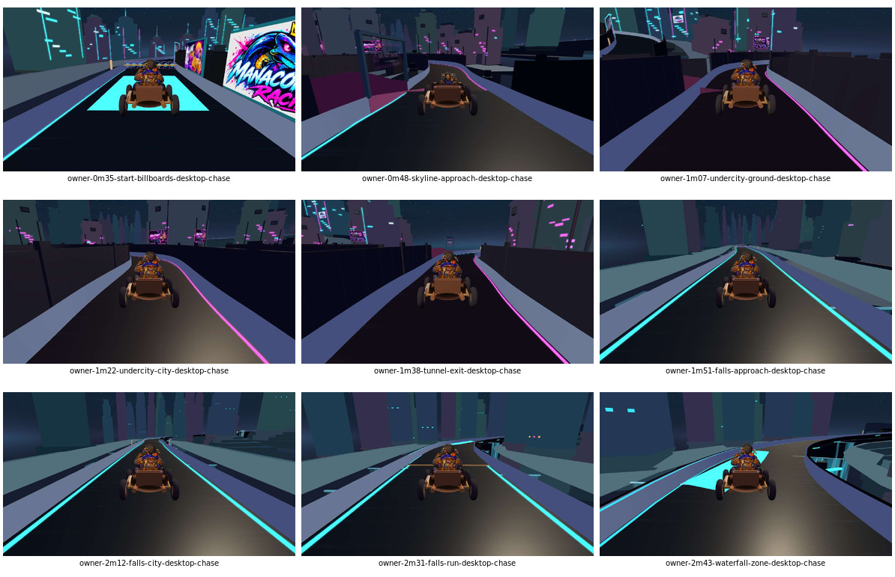

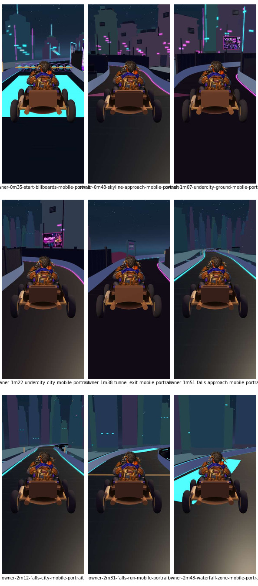

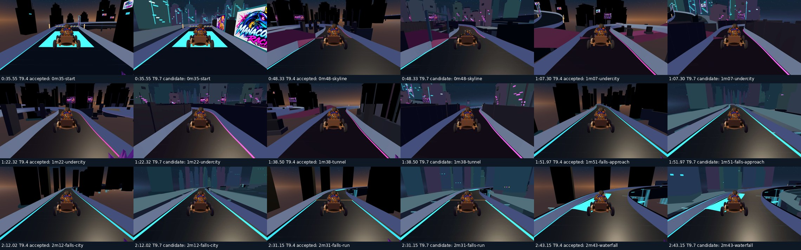

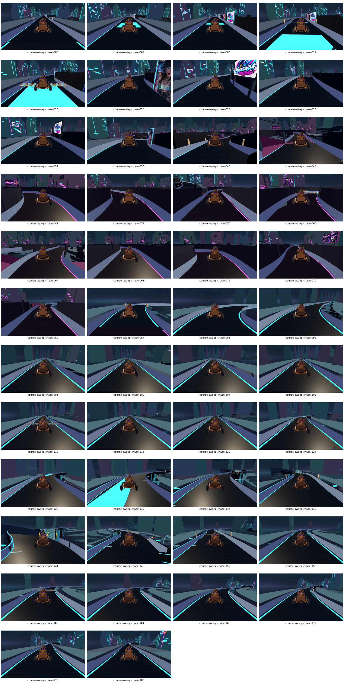

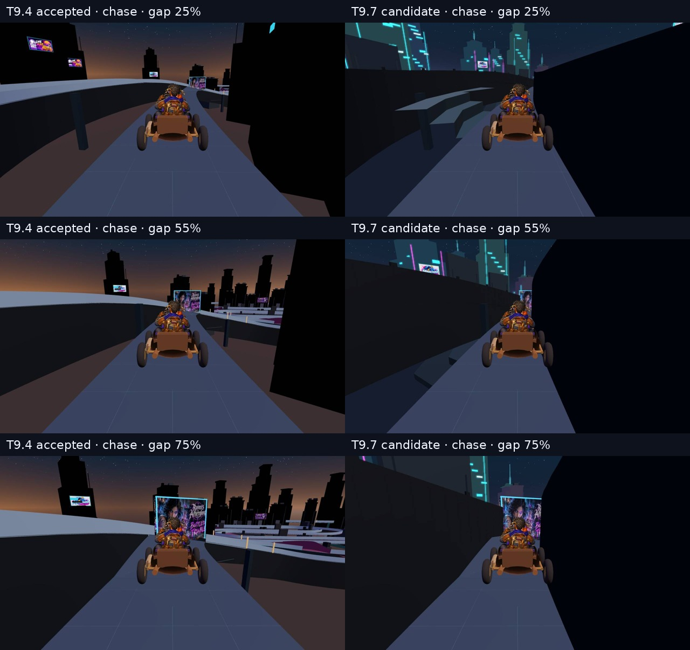

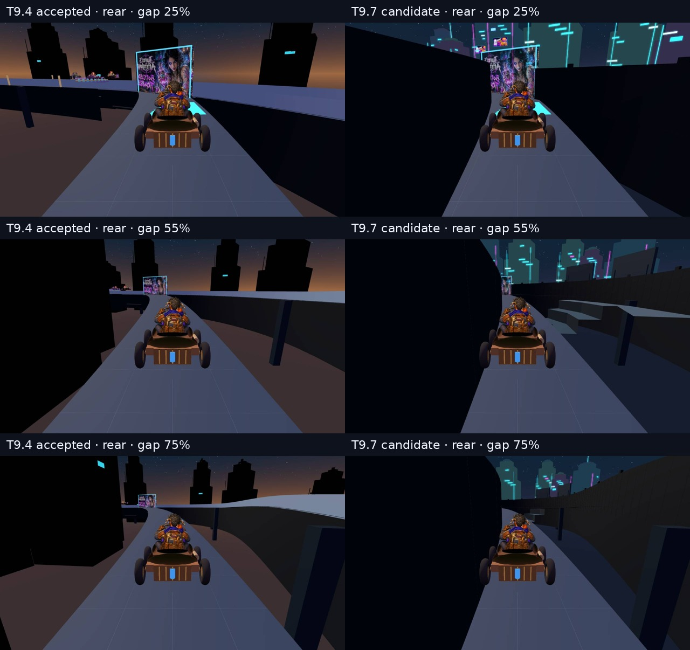

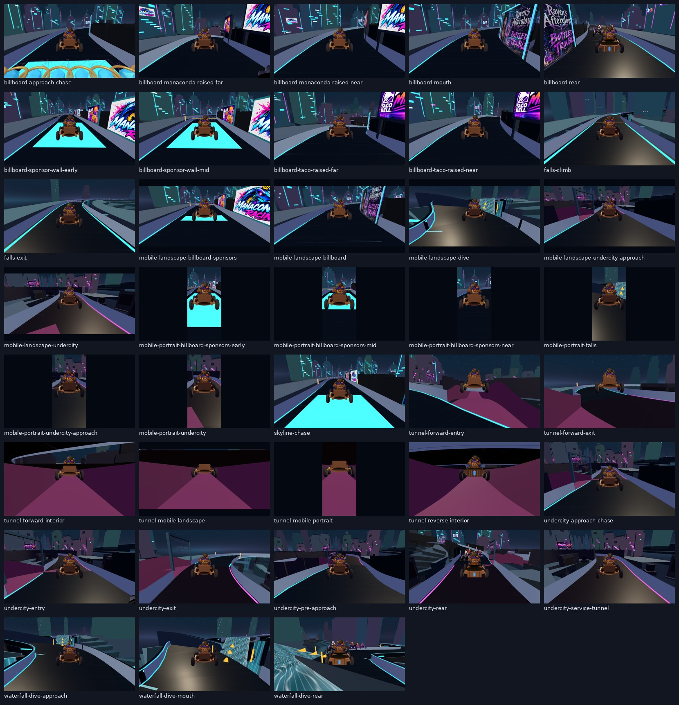

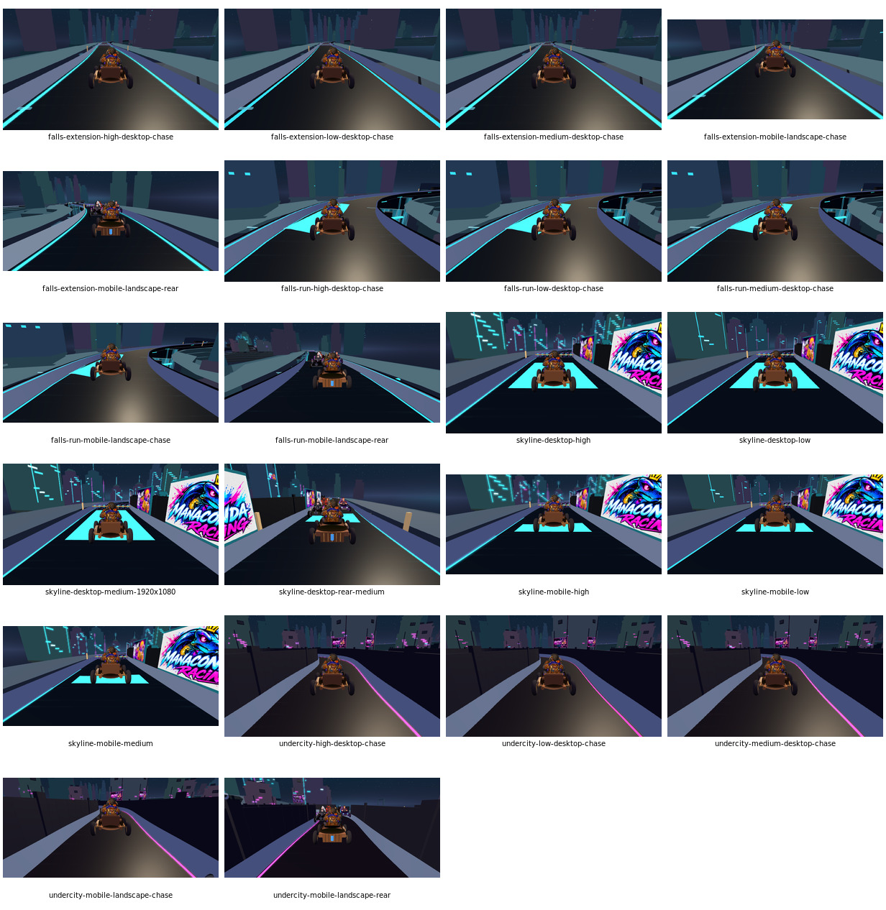

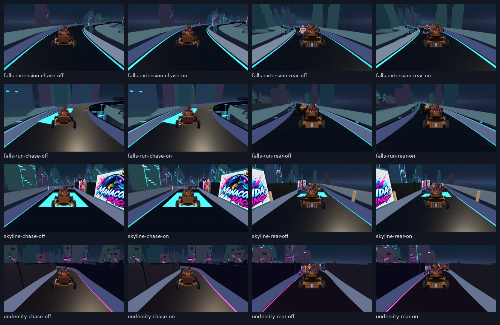

The four owner-view sheets cover desktop chase/rear and mobile-portrait chase/rear. The full course sweep has 182 positions at no more than 7.97 m spacing, in desktop chase/rear views. The full Billboard Gap path has 12 desktop fractions and three mobile-portrait fractions, both chase/rear. Raw captures and machine-readable reports are stored alongside the sheets.

## Historical comparison

- **Last owner-approved runtime used for visual comparison:** T9.4 commit `be47a3d7215867b9b275473fd2640cc626ef5e37`. Its matching owner-anchor captures and Billboard Gap sweep are in `owner-anchor-baseline/t9-4-accepted/` and `billboard-gap/t9-4-accepted/`.
- **Rejected historical candidate:** T9.5 preview pin `64492df` was owner-rejected. It is not treated as an accepted baseline.
- **Pre-amendment T9.7 runtime:** PR #285 source `90ae7d5ff953fe90d40043de957507d7b79a3ef5`; it lacked the expanded Undercity ground and full Falls extension coverage. This is the implementation comparison point, not owner acceptance.

The T9.4 comparison shows the shortcut’s dark deck underside and portal art already existed at matching path fractions. The candidate fills the adjoining city field with supported terraces and preserves the driving surface and visible signs.

## Current expanded-correction captures

These captures were generated from the current local correction source on 2026-10-10. They are evidence for review; the immutable preview will be built from the final committed source SHA after validation.

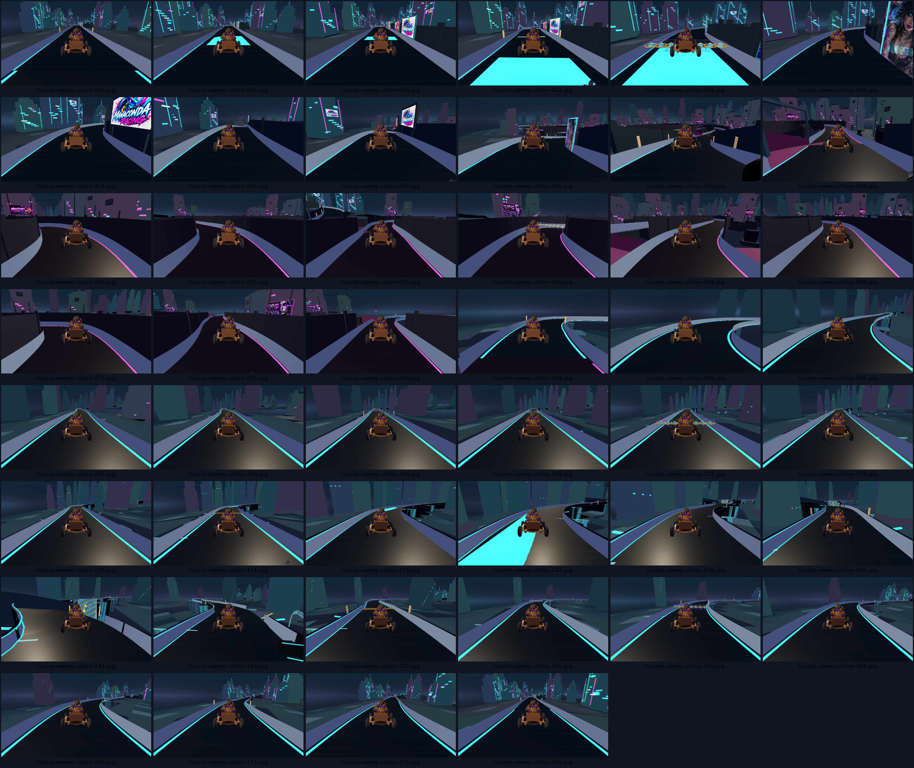

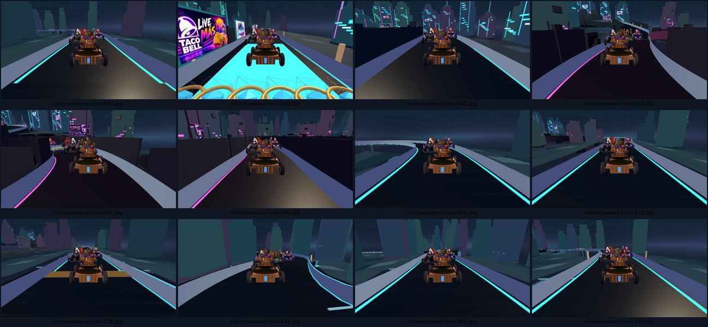

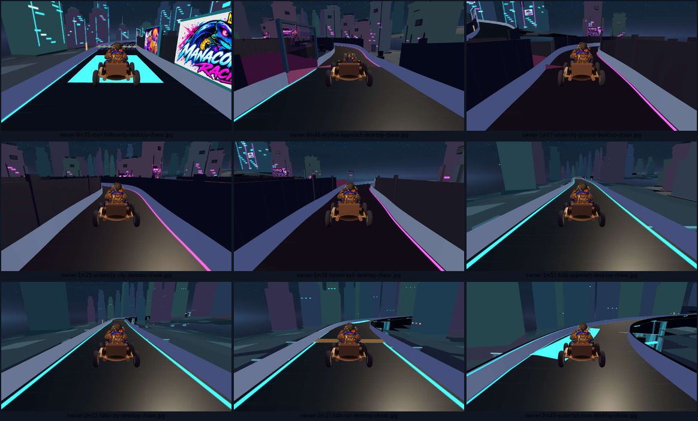

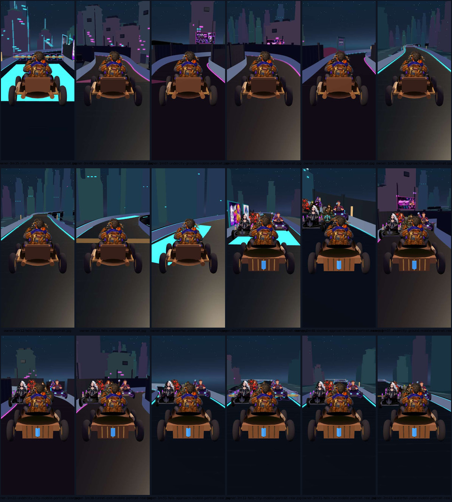

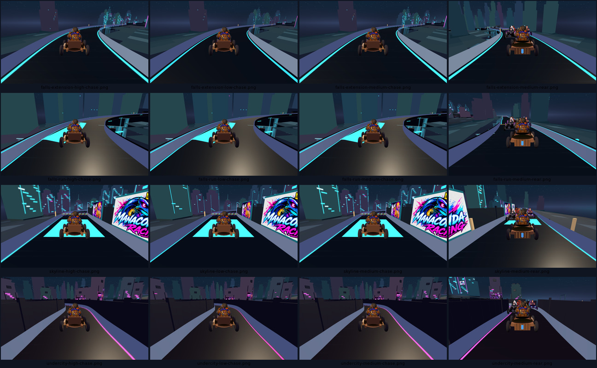

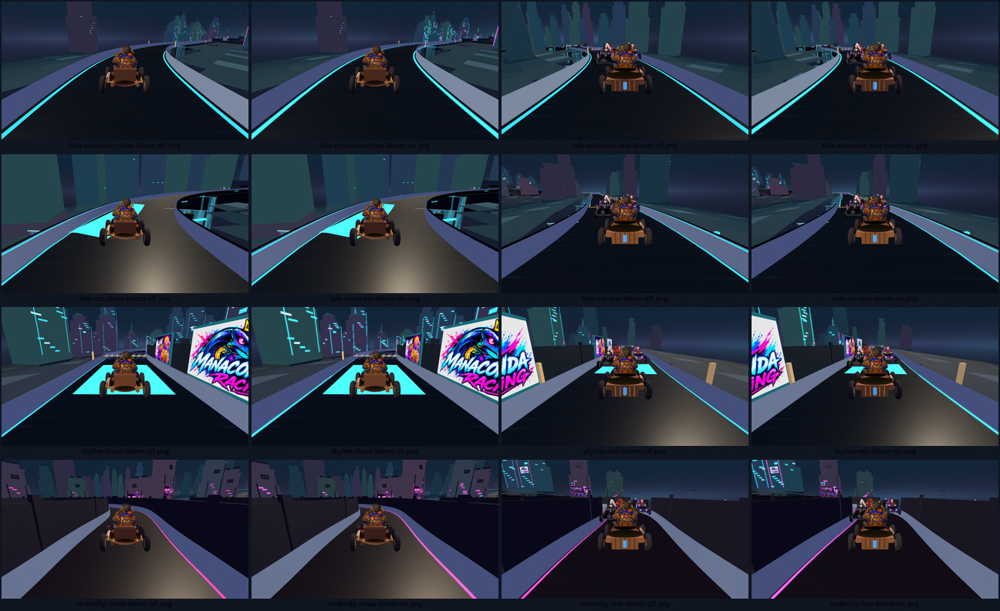

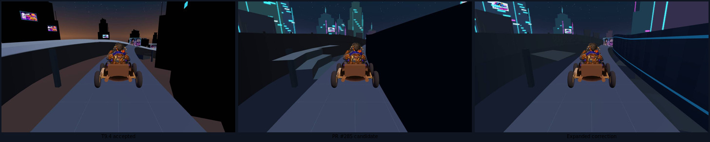

### Current measurements

- **Continuous camera sweep:** 182 positions over the 1,448.94 m course; maximum spacing 7.9612 m; chase and rear frames; zero browser/render errors. Peak: **494 calls / 416,487 triangles**.
- **Owner regressions:** all nine reported anchors captured in desktop chase/rear and mobile portrait chase/rear.
- **Graphics quality:** 16 Low/Medium/High captures across Skyline, Undercity, Falls Run, and Falls extension, including Medium rear views; zero errors. Peak: **386 calls / 402,847 triangles**.
- **Bloom:** 16 Medium captures across the same sectors and cameras, with bloom enabled and disabled. The renderer reported both states correctly; seven of eight sector/camera pairs changed visually. Falls Run chase was unchanged; its rear view changed. Zero errors.
- **Billboard Gap:** 30 captures across 12 desktop fractions and three mobile portrait fractions, chase/rear; zero errors. Peak: **378 calls / 303,179 triangles**. The fraction `0.25` comparison shows the old brown exposure and pre-correction wedges beside the current connected floor.
- **Background-source audit:** 9 camera anchors, 25 actual rendered-pixel ray samples per anchor, and six lateral city-floor probes per anchor; zero browser errors and no near-coincident ground pairs. The remaining sky hits use the cool nighttime shader, not the prior orange/brown horizon treatment.
- **Budgets:** Task 9 remains **500 calls / 425,000 triangles**; PRD remains **500 calls / 750,000 triangles**. Neither was raised.

Raw captures and JSON reports are in `source-final-2026-10-10/`. The course, quality, bloom, and Billboard Gap sweeps use the actual KartTimeTrial scene under local Chromium software WebGL / SwiftShader. These are structural and visual checks; mobile viewports are simulations and this evidence does not certify G-05 representative-device performance.

## Validation record

The targeted T9.7 city-ground suite passes **25/25**. Typecheck and zero-warning lint pass. The complete repository test suite and production build are still running; their exact results and the final pinned source SHA will be recorded before owner acceptance is requested.

Do not merge runtime PR #285 or #242, publish Neon Grid gameplay to production, or advance to T9.8 before Manny accepts the new immutable preview.
